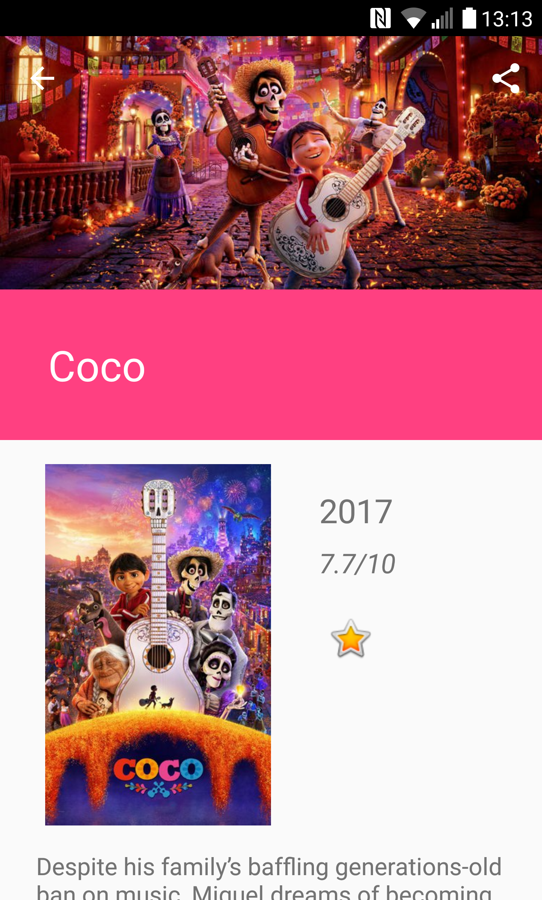
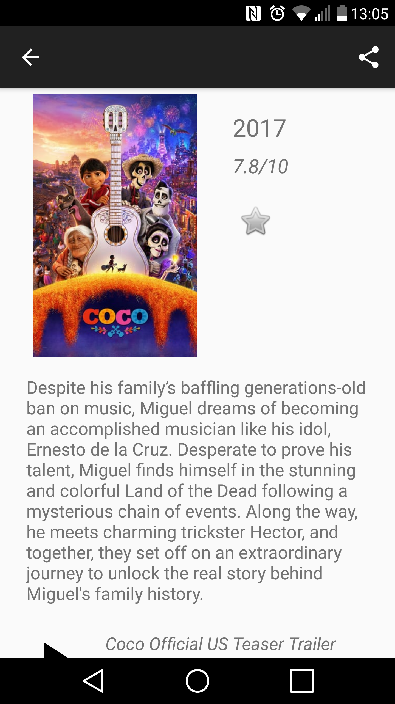
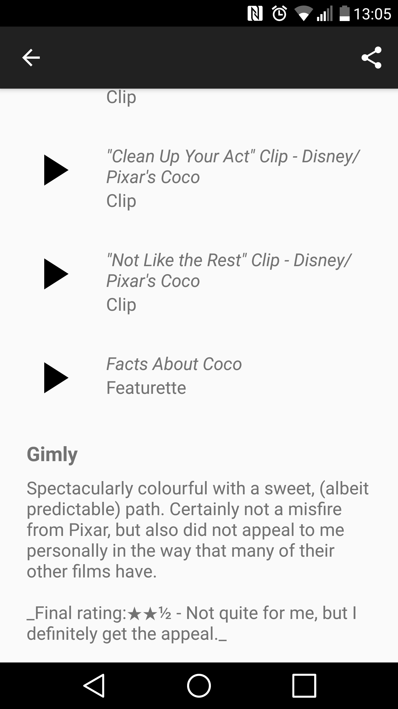
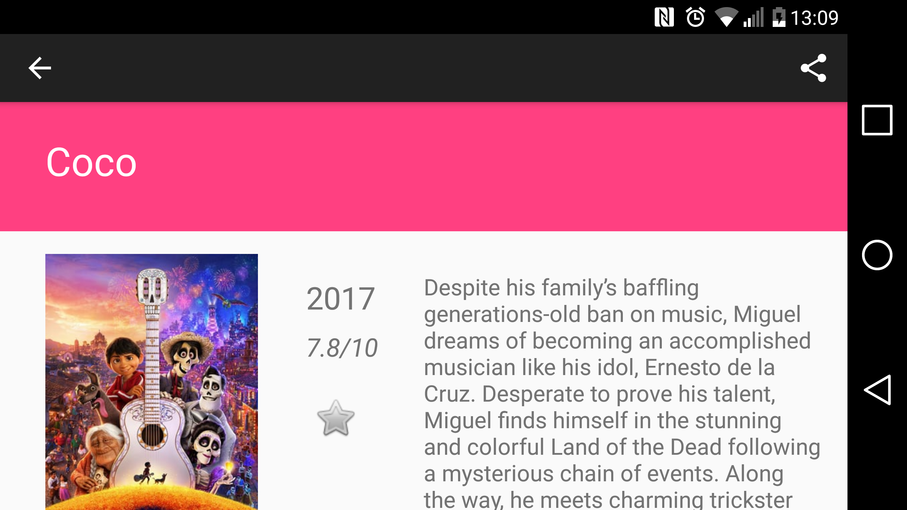
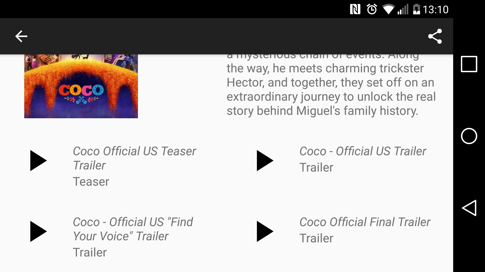

# PopularMoviesProject

Popular Movies App - Android Development Nanodegree by Google (project 1 and 2)

Popular Movies project is a part of Android Development Nanodegree by Google.

It was later renamed to Tiolia Movies and it may downloaded on Google Play here:
https://play.google.com/store/apps/details?id=com.tioliaapp.android.tioliamovies

Screenshots:

Portrait

Landscape

Description:

*	Tiolia Movies displays movie posters in a GridLayout and, when the user taps on a poster, it presents 
the main information about the chosen movie as well as allows the user to read reviews and watch videos on Youtube
*	Communicates with The Movie Database API from which gets information about popular and top rated movies
*	Allows the user to mark a movie as their favorite
*	Provides the user with the possibility to select which movie posters to display (popular, top rated or favorite) 
and choose to get notifications storing their choices in the preferences
*	Works offline as the app stores all the main information about movies in the local SQL database which is accessed 
through a content provider as suggested by Google
*	Uses services to sync local SQL database every ~4 hours and send notifications about the most popular movie
* Allows the user to share title, release date and rating of the chosen movie

This application uses the following libraries:
* Firebase JobDispatcher
* Butter Knife
* Picasso

I made this project to learn how to:
* use RecyclerView providing different layouts depending on different view types
(it was not required to use RecyclerView, but I chose to use it to learn how to apply it because it provides more 
functionalities than a simple ListView and it will be usefull to know how to implement RecyclerView in the future)
* use services to sync local database with the server and send notification
* allow the user to share specific information
* create CoordinatorLayout
* apply specific design  patters, such as Snackbar, CollapsingToolbar
* display videos on Youtube
